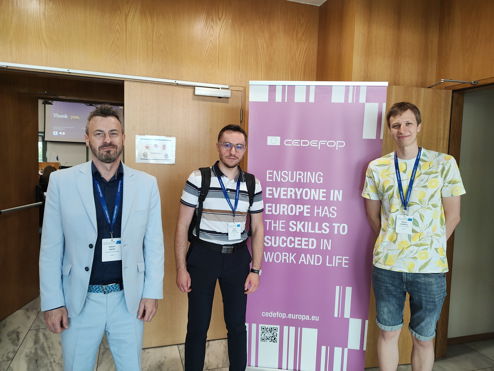

W dniach 28–29 maja 2026 r. delegacja OJALAB w składzie Robert Pater, Adam Struzik i Michał Warmuz uczestniczyła w międzynarodowej konferencji naukowej „Harnessing web data for next-generation skills intelligence”, organizowanej przez Cedefop we współpracy z Eurostatem w Salonikach. Wydarzenie zgromadziło czołowych badaczy dużych zbiorów danych na potrzeby rynku pracy, przedstawicieli instytucji europejskich, ekspertów rynku pracy oraz zespoły rozwijające zaawansowane metody analizy danych internetowych na potrzeby polityk edukacyjnych i zatrudnieniowych. Obecność delegacji OJALAB obejmowała udział w sesjach merytorycznych, spotkania networkingowe oraz wygłoszenie referatu.

### Prezentacja wyników projektu OJALAB

Podczas sesji 1b Robert Pater zaprezentował wyniki badań realizowanych w ramach projektu OJALAB, w referacie pt.:
„What jobs do Polish companies offer to Ukrainian refugees? The role of occupational heterogeneity and dynamic changes over the war”.
Badanie oparte na 2,5 mln ofert pracy z portalu pracuj.pl (2022–2025) pokazuje, jak polscy pracodawcy reagowali na napływ uchodźców z Ukrainy oraz jak zmieniała się struktura popytu na pracę w czasie wojny. Analiza wykorzystuje zaawansowane metody przetwarzania języka naturalnego oraz klasyfikacji zawodów opracowane w ramach OJALAB.

### Najważniejsze wnioski prezentowane na konferencji

- początkowo oferty kierowane do uchodźców dotyczyły często zawodów wysokokwalifikowanych,
- regionalnie popyt przesuwał się z Polski wschodniej do centralnej i zachodniej,
- z czasem nastąpiło przesunięcie w stronę zawodów średnio- i niskokwalifikowanych, odpowiadające chronicznym niedoborom kadrowym,
- oferty dla uchodźców częściej obejmowały elastyczne formy zatrudnienia,
- nie stwierdzono jednolitej „kary płacowej” dla uchodźców; w części zawodów o średnich lub niskich wynagrodzenia były nieco wyższe niż w ofertach skierowanych do wszystkich.

Wyniki te pokazują, że dane z ofert pracy pozwalają uchwycić dynamiczne, popytowe mechanizmy integracji uchodźców, które nie są widoczne w tradycyjnych statystykach.

### Znaczenie dla rozwoju OJALAB

Konferencja Cedefop i Eurostat potwierdziła, że analiza danych internetowych staje się kluczowym narzędziem w monitorowaniu popytu na umiejętności i projektowaniu polityk rynku pracy. Referat OJALAB wniósł do dyskusji unikalną perspektywę dotyczącą zachowań pracodawców wobec uchodźców z Ukrainy oraz dynamiki zmian w strukturze zawodowej i regionalnej. Wyjazd umożliwił przedstawienie polskich doświadczeń w analizie OJA na forum europejskim, wzmocnił współpracę z międzynarodowymi zespołami, potwierdził znaczenie OJALAB jako jednego z najbardziej zaawansowanych laboratoriów analizy ofert pracy w Europie oraz otworzył nowe możliwości integracji danych OJA z danymi o zatrudnieniu, wynagrodzeniach i systemem edukacji.

{width="60%" fig-align="center"}
