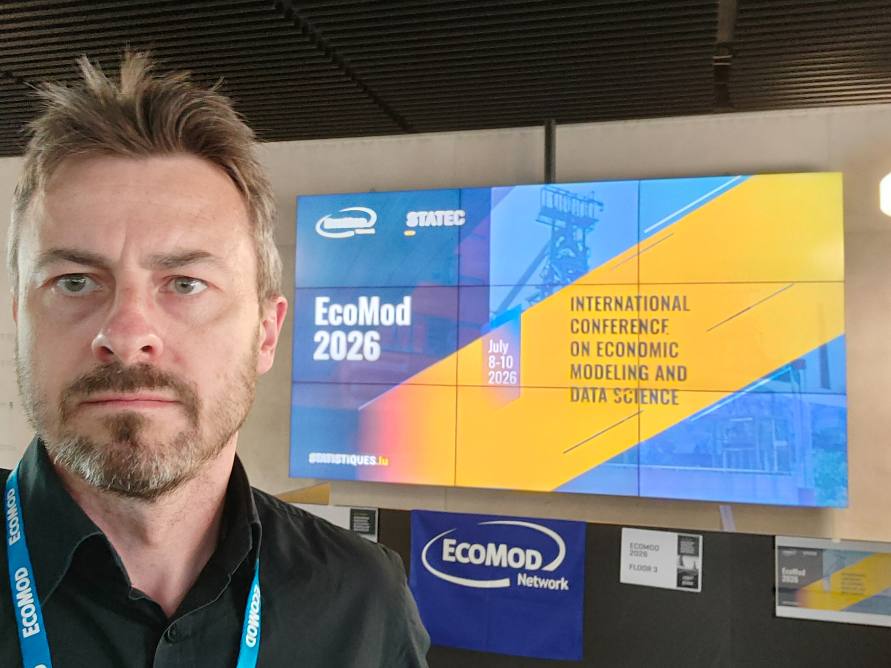
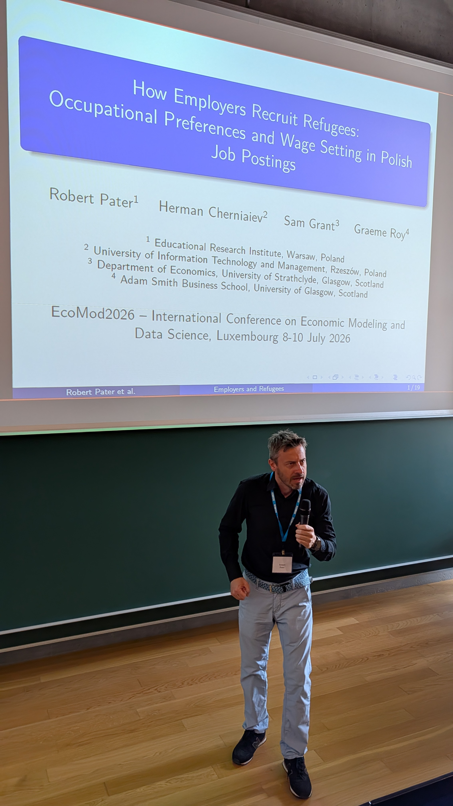
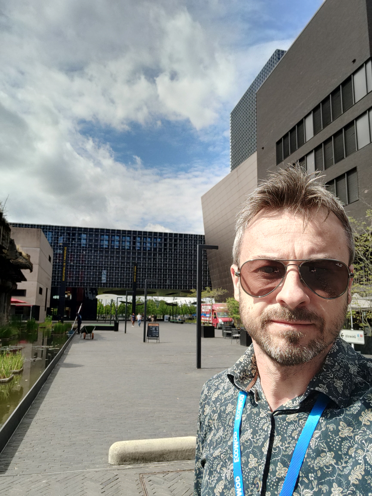
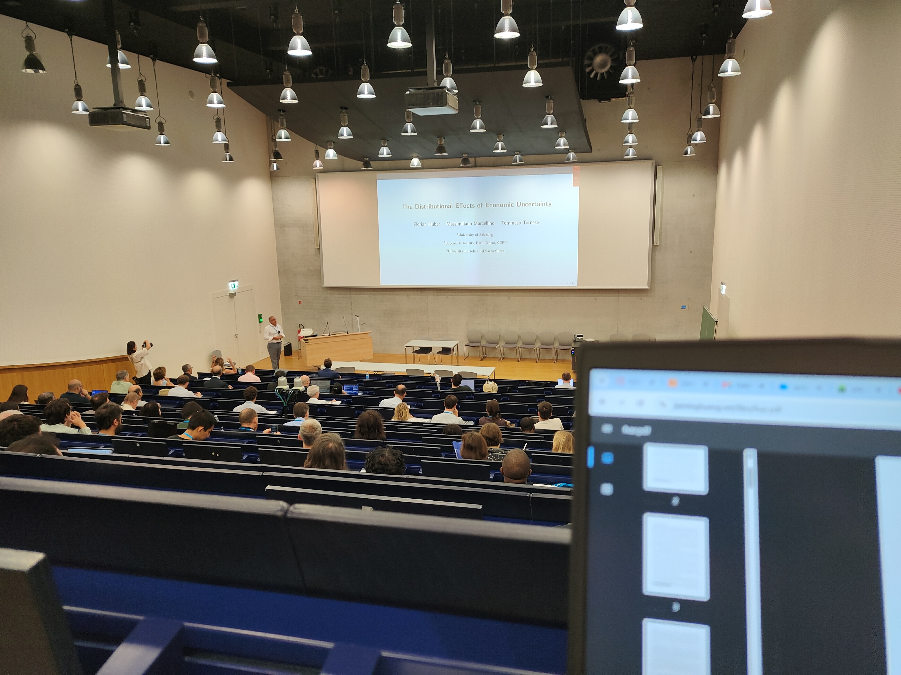
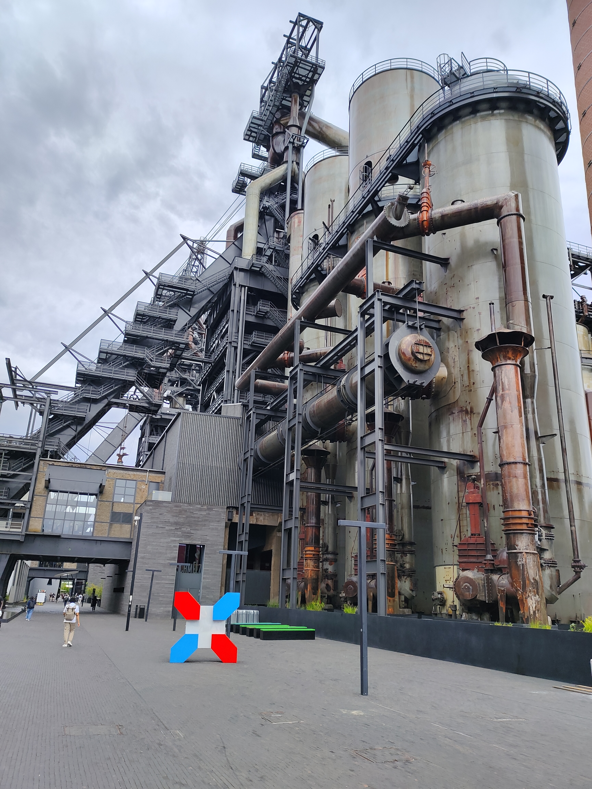

W dniach 8–10 lipca 2026 r. Robert Pater z OJALAB uczestniczył w międzynarodowej konferencji naukowej „EcoMod2026 – International Conference on Economic Modeling and Data Science”, organizowanej przez EcoMod we współpracy z University of Luxembourg w Luksemburgu. Konferencja EcoMod2026 zgromadziła szerokie grono badaczy, praktyków i instytucji publicznych zajmujących się modelowaniem ekonomicznym, analizą danych oraz politykami gospodarczymi. Program obejmował 63 sesje tematyczne i 196 referatów, co odzwierciedla zarówno skalę wydarzenia, jak i jego znaczenie dla współczesnej ekonomii empirycznej. Wydarzenie było intensywnie skoncentrowane na wykorzystaniu zaawansowanych metod modelowania – od CGE i DSGE, przez mikrosymulacje, po uczenie maszynowe i analitykę big data – oraz na ich zastosowaniach w politykach publicznych, transformacji energetycznej, rynku pracy, finansach i integracji społecznej.

Głównym problemem poruszanym na konferencji była rosnąca potrzeba integrowania klasycznych modeli ekonomicznych z nowymi źródłami danych oraz metodami analitycznymi. W wielu sesjach podkreślano, że tradycyjne narzędzia – choć nadal ważne – nie są wystarczające do uchwycenia współczesnych zjawisk gospodarczych, takich jak szybkie zmiany technologiczne, kryzysy energetyczne, migracje, zmiany klimatyczne czy niestabilność makroekonomiczna. W tym kontekście szczególne znaczenie miały sesje poświęcone sztucznej inteligencji, big data oraz modelom hybrydowym, które łączą podejścia statystyczne, ekonometryczne i symulacyjne.

Dyskutowano również o tym, jakie dane są potrzebne, aby modele ekonomiczne mogły realnie wspierać polityki publiczne oraz jak instytucje statystyczne powinny adaptować się do nowych źródeł informacji, takich jak ogłoszenia o pracy, dane administracyjne wysokiej częstotliwości czy dane z platform cyfrowych. Konferencja pokazała, że rośnie znaczenie badań empirycznych opartych na dużych zbiorach danych, a jednocześnie rośnie potrzeba ich odpowiedzialnego wykorzystania.

Referat OJALAB bardzo dobrze wpisał się w powyższe zagadnienia, gdyż dotyczył nowatorskiego zastosowania danych internetowych dla rozwiązywania problemów teoretycznych, ale również polityki edukacji i rynku pracy.

W trakcie konferencji wyraźnie ujawniło się kilka wspólnych wniosków, które przewijały się przez różne sesje tematyczne. Wiele prezentacji wskazywało na rosnącą złożoność współczesnych gospodarek, co wymaga stosowania modeli wielowymiarowych, dynamicznych i zdolnych do integracji heterogenicznych danych. Modele CGE i DSGE były nadal szeroko wykorzystywane, ale coraz częściej łączono je z mikrodanymi, modelami agentowymi oraz uczeniem maszynowym, aby uchwycić zachowania jednostek, firm i regionów.

Sesje dotyczące rynku pracy i migracji pokazały, że integracja migrantów i uchodźców jest procesem silnie zależnym od lokalnych warunków gospodarczych, struktury popytu na pracę oraz zachowań pracodawców. W wielu krajach obserwuje się segmentację rynku pracy, niedopasowania kompetencyjne oraz zróżnicowane strategie rekrutacyjne firm. Wnioski te były spójne z obserwacjami z referatu OJALAB, ale były również obecne w innych prezentacjach dotyczących mikrosymulacji, regionalnych modeli rynku pracy czy analiz big data.

W sesjach poświęconych sztucznej inteligencji i uczeniu maszynowym dominował wniosek, że metody ML stają się integralną częścią analityki ekonomicznej, ale wymagają odpowiedniej interpretowalności, walidacji i integracji z teorią ekonomiczną. Wiele prezentacji pokazywało, że modele ML mogą znacząco poprawić prognozy, klasyfikacje i wykrywanie anomalii, lecz ich użycie musi być osadzone w kontekście instytucjonalnym i politycznym.

Wreszcie, panel końcowy podkreślił, że przyszłość modelowania ekonomicznego zależy od zdolności instytucji publicznych do pozyskiwania, integrowania i udostępniania nowych źródeł danych. EUROSTAT i STATEC wskazywały, że dane z platform cyfrowych, ogłoszeń o pracy i rejestrów administracyjnych będą kluczowe dla nowoczesnych polityk publicznych.

{width="60%" fig-align="center"}

{width="60%" fig-align="center"}

{width="60%" fig-align="center"}

{width="60%" fig-align="center"}

{width="60%" fig-align="center"}
